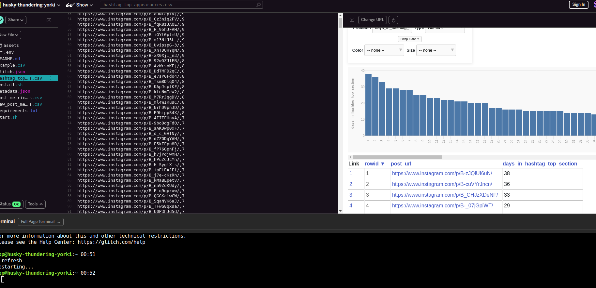

# FINESSE

#### Assumptions and Findings
1. Spark isn't needed at POC because the POC can be completed
with small sample files. However, for production I think this is 
encouraged. 

2. The scalability of this architecture is a major factor in why 
    a declarative and object oriented structure has been used. 
    
    Attributes may be added to the class after its construction, and they will be added to the underlying Table and mapper() definitions as appropriate:
    ```
    SomeClass.data = Column('data', Unicode)
    SomeClass.related = relationship(RelatedInfo)
   ```

3. There is some new and very cool tech called *_Datasette_* , it's a lightweight
tool that sits (alongside) flat files that allows for quick data 
interaction and analysis. Depending on the volume, velocity, and variety
of our data sources. This may get us insights significantly faster 
while allowing us time to build towards a production environment. 

- https://datasette.readthedocs.io/en/stable/index.html

Example with our data:

- https://glitch.com/~husky-thundering-yorki




## RUN
I. Run the following commands in your terminal:

`$ python ddl.py`


Now a new sqlite3 db file called *finesse_db* will be created in local 
directory.

II. Next
 
`$ python process_data.py`

The local database (or db wherever the connection target is) should now 
be loaded with relevant datatypes and values.

III. 
